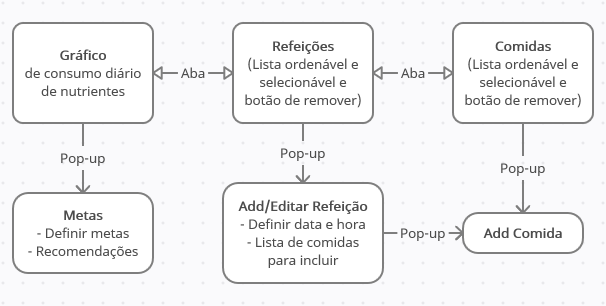
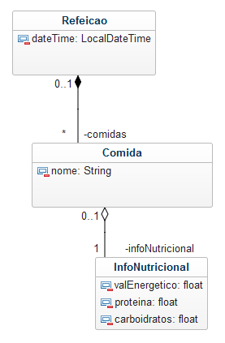

# LS_ip2_nutricao

Projeto em grupo para a disciplina Introdução à Programação 2. Um programa que ajuda o usuário a cuidar da nutrição.

### Integrantes

- [@VelocityIsntSpeed](https://github.com/VelocityIsntSpeed/)
    (Leandro Gabriel)
- [@rksamu](https://github.com/rksamu/)
    (Samuel Justino)

## Descrição

Um app que ajuda o usuário a cuidar da nutrição de forma prática. A pessoa registra o que comeu e ele conta as calorias, proteína, fibra, vitaminas, etc. e fornece relatórios, comparando com as metas definidas pelo usuário e recomendações. O usuário pode adicionar pratos e ingredientes personalizados ao banco de dados do app. Também ajuda a elaborar refeições saudáveis, mostrando a informação nutricional conforme a pessoa vai modificando a lista de ingredientes de uma refeição.

## Requisitos

1. Listar, remover, adicionar e editar refeições
    1. Ordenar as refeições por data ou qualquer nutriente
    2. Ao adicionar/editar refeições, escolher as comidas da refeição, definindo a quantidade de cada
    3. Ao adicionar/editar refeições, ver em tempo real a informação nutricional da mesma

2. Listar, remover, adicionar e editar comidas
    1. Não permitir comidas duplicadas
    2. Ordenar as comidas por nome ou qualquer nutriente

3. Ver gráfico de consumo diário de nutrientes, comparando com as metas
    1. Definir metas
    2. Especificar o período de tempo do gráfico

4. Persistência de dados em arquivo (os dados ficam salvos após fechar o programa)

5. Validação do input do usuário

6. Regras de negócio

## Diagrama de modelo navegacional da GUI

## Diagrama de classes (desatualizado)

